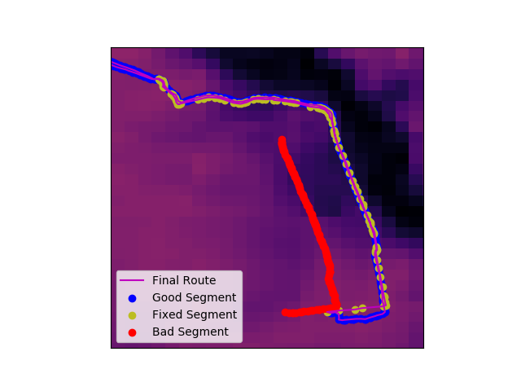

# GPS-File-Repair
Sometimes the gps on your run/ride/swim/etc just sucks. Assuming that the total time is correct, this will take your average pace and recreate the bad part. It takes a gpx file created from gmap-pedometer.com that maps your actual route, applies the average pace to it, and combines the new data with your good data. It is currently only set up to work if the good segment and bad segment of your file are split into two separate files. It also uses 3DEP data downloaded from <a href="https://www.usgs.gov/core-science-systems/ngp/3dep">here</a> to calculate the elevation at each of the latitude and longitude points of the gpx file exported from gmap-pedometer.com.

```
To do:
* Improve functionality to split bad segments and good segments from a single file
```

Here is a sample elevation profile of one of my broken runs showing the bad data, good data, and total fixed route:

